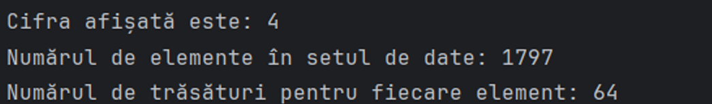
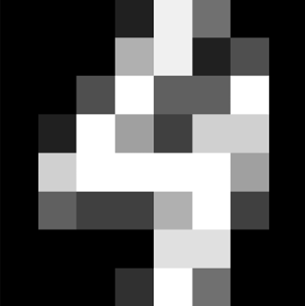
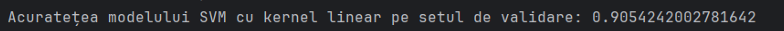
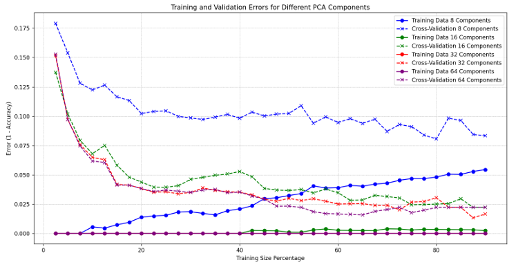

# Project Instructions🧪

## Table of Contents📑
- [Digits Dataset Loading](#digits-dataset-loading)
- [Dimensionality Reduction with PCA](#dimensionality-reduction-with-pca)
- [Training an SVM Classifier](#training-an-svm-classifier)
- [Varying Components and Training Set Size](#varying-components-and-training-set-size)

---

### Digits Dataset Loading🧮

---

#### Problem:
We will load the **Digits Dataset** from scikit-learn.
- How many elements are in the dataset?
- How many features does each element have?
- What do the features represent?

#### Solution:
1. **Loading the dataset:**
   - Use `load_digits()` to load a predefined dataset containing images of handwritten digits.
2. **Selecting a random image:**
   - Select a random index from the dataset to ensure a different result with each run of the script.
3. **Resizing and displaying the image:**
   - Resize the image to its original 8x8 pixel format to display it properly. Use Matplotlib to display the image, selecting a grayscale color map and hiding axes for better clarity.
4. **Displaying dataset information:**
   - Display the total number of images and the number of features per image. This helps to understand the structure and size of the dataset.

#### Results:
- **Number of elements in the dataset:** 1797
- **Number of features for each element:** 64
- **Feature explanation:** The features represent individual pixel intensity values from each image of a digit. The dataset consists of grayscale images of size 8x8 pixels. Each image is transformed into a vector of length 64 (8x8), where each element of the vector corresponds to the intensity value of a pixel in the image.

  
   
  <em>Results</em>
   
   
  
   
  <em>Number Digit</em>

---

### Dimensionality Reduction with PCA📉

---

#### Problem:
We will reduce the dimensionality of the data using **Principal Components Analysis (PCA)**.

#### Solution:
1. **Initializing PCA:**
   - Create a PCA object from `sklearn.decomposition`, specifying the number of principal components to be 8. This means reducing each image from a 64-dimensional vector (8x8 pixels) to just 8 components while preserving the essence of the data.
2. **Training the PCA model:**
   - Apply the `.fit()` method to the data `x` (where `x` represents the feature matrix of the dataset, i.e., pixel intensities for each image). This allows the PCA model to learn and identify the 8 principal components that capture the most variance in the data.
3. **Transforming the data:**
   - After training the PCA model, use `.transform()` to apply the dimensionality reduction to the entire dataset `x`. This converts each image from the original 64 features to the new reduced 8 features.

#### Results:
The dimensionality of the data is reduced while retaining the main characteristics of the images.

---

### Training an SVM Classifier🧠

---

#### Problem:
We will train an **SVM classifier** on a training subset (e.g., 60% of the total data) and validate it on a validation subset.

#### Solution:
1. **Splitting the data into training and validation sets:**
   - Use `train_test_split` from `sklearn.model_selection` to split the data `x_pca` and labels `y` into training and validation sets. Set `test_size=0.4` so that 40% of the data is used for validation, and the remaining 60% is used for training. `random_state=42` ensures reproducibility with the same seed for random number generation.
2. **Training the SVM classifier with different kernels:**
   - Initialize and train an SVM classifier for each kernel type specified in the list (`'linear'`, `'rbf'`, `'poly'`). This means repeating the training process for each kernel type, adjusting the classifier to fit the training data `x_train` and labels `y_train`.
3. **Model evaluation:**
   - After training each classifier, use the validation set to predict the labels `y_predicted`. Evaluate the model's performance by calculating the **accuracy score**, which measures the proportion of correct predictions among the total predictions made. Display the accuracy of each model to compare the efficiency of different kernels on the validation set.

#### Results:
The performance of the SVM classifiers with different kernels will be displayed, and accuracy scores will be provided for each model.

  
   
  <em>Accuracy</em>

$Accuracy = \frac{\text{Number of Correct Predictions}}{\text{Total Number of Predictions}}$

---

### Varying Components and Training Set Size📊

---

#### Problem:
We will vary the number of components and the training set size and plot learning curves based on the varied parameters.

#### Solution:
1. **Defining PCA Components and Training Set Sizes:**
   - Define a list `components` that contains the number of PCA components to test.
   - Define `training_sizes` using `np.linspace` to generate a vector of training set sizes, ranging from 2.5% to 90% in 36 steps.
2. **Initializing Error Dictionaries:**
   - Create two dictionaries, `train_errors` and `validation_errors`, to store the training and validation errors for each number of PCA components.
3. **Evaluation Process:**
   - Iterate through each number of PCA components:
     - Apply PCA on the dataset `x` to reduce dimensionality.
     - For each training set size:
       - Split the data into training and validation sets.
       - Train an SVM classifier with a linear kernel.
       - Predict and calculate accuracy for both training and validation sets.
       - Calculate the error as 1 - accuracy and add it to the respective dictionaries.
4. **Plotting Results:**
   - Plot the training and validation errors for each PCA configuration using different colors to distinguish between the numbers of components.
   - Set axis labels, the title of the plot, a legend, and a grid to enhance the clarity of the visualization.

#### Results:
The results will include plots showing how the number of PCA components and the training set size affect the model's performance.

  
   
  <em>Training and Validation Errors for different PCA Components</em>

$Error = 1 - Accuracy$

---
